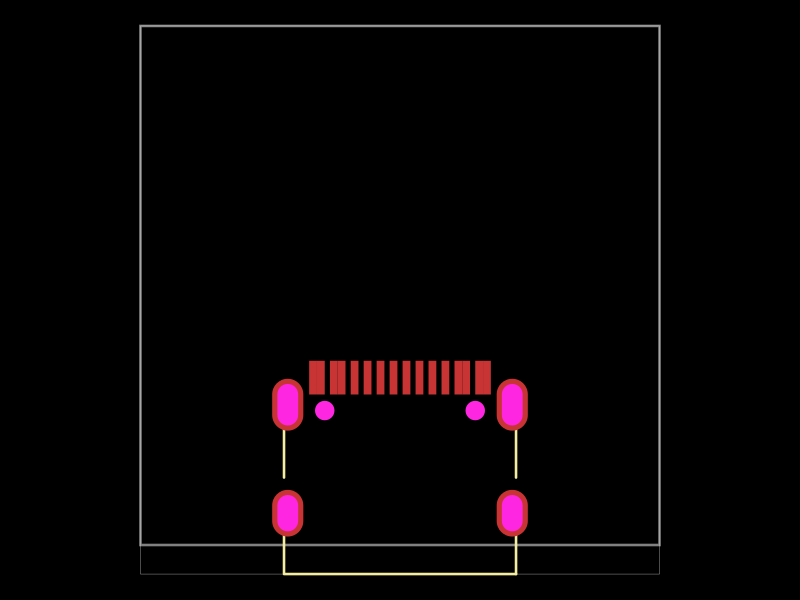
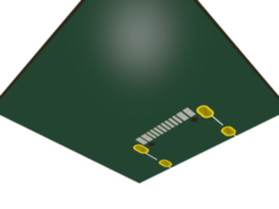

# Repro 31: OBJ-only USB-C model omitted from KiCad export

## Problem and motivation

The `seveibar/smd-usb-c` connector body is visible in tscircuit, but the
exported KiCad board contains only the connector footprint. A board can therefore
appear to have exported successfully while losing a component's mechanical
representation. This repro isolates that model-format limitation so maintainers
can choose between adding a supported model to the component, implementing
conversion, or reporting unsupported model formats explicitly.

## Fixture and isolation

`assets/smd-usb-c-obj-only.tsx` is a vendored, formatting-normalized copy of
`seveibar/smd-usb-c` version 0.0.2, release
`a2a7a2e5-1cf5-4a6d-ac90-6ff691e94b1d`, retrieved on 2026-09-03:

[Registry source](https://api.tscircuit.com/package_files/get?package_release_id=a2a7a2e5-1cf5-4a6d-ac90-6ff691e94b1d&file_path=index.tsx)

The fixture retains the original footprint, pin aliases, model URL, and model
offsets. Compatibility edits use unparameterized `ChipProps`, remove redundant
unsupported plated-hole `height` properties, and provide `holeWidth`/`holeHeight`
with the same values as legacy `innerWidth`/`innerHeight`. Vendoring avoids a
mutable registry import or a new package dependency.
The test generates Circuit JSON using `Circuit`; it does not invent input JSON
or strip a STEP URL from an otherwise supported component.

The board has only one top-side connector. GND and VBUS contacts have their
respective net assignments. Routing is disabled because it is unrelated to
model export. No display, bottom-side transform, downloaded STEP file, or
external model search path is involved. `includeBuiltin3dModels: true` ensures
the omission is not caused by disabling model packaging.

## Run

From the repository root, with dependencies installed and KiCad CLI 10 on PATH:

```sh
bun test tests/pcb/repros/repro31-usb-c-obj-only-model.test.tsx
```

The test writes these inspectable artifacts into ignored `debug-output/`:

- `repro31-usb-c-obj-only.circuit.json`
- `repro31-usb-c-obj-only.kicad_pcb`

Open the latter in KiCad's 3D Viewer to inspect the missing connector body.
The original OBJ is not fetched to produce the KiCad snapshot: the exporter
does not request any model download in this case.

## Evidence and expected behavior

The test asserts that the generated CAD component has the original OBJ URL,
no STEP/WRL URL, and no builtin footprinter fallback. The converter exports
one footprint, 22 pad entries (16 SMT contacts, four plated mounting holes,
and two non-plated holes), zero model entries, and an empty model download list.
The serialized PCB also has no model entry.

The cause is `create3DModelsFromCadComponent`: it selects `model_step_url` or
`model_wrl_url`, returning no models when both are absent. This connector has
only `model_obj_url`. Thus this is an omitted model, not a failed download or
a KiCad viewer visibility setting.

Desired user-facing behavior is a corresponding supported connector model in
KiCad, or an explicit explanation that the supplied model cannot be exported.
Adding a matching STEP model to the component is the direct component-level
remedy; exporter-side OBJ conversion or diagnostics are separate design choices.

**This is a characterization test of the current omission.** It passes while
the limitation exists. It must be revised to assert the chosen supported
behavior when a fix is introduced; its zero-model assertions are not the desired
long-term export contract.

## Snapshots

Generated directly from the reduced test:



The input image is a 2D PCB snapshot, not a tscircuit 3D rendering. It establishes
the footprint geometry. The input OBJ URL is verified structurally by the test.



`repro31-usb-c-obj-only-model.test.tsx.snap` records the input model formats,
exported footprint/pad/model counts, and download list.

The KiCad render is flattened onto white, resized to 400 × 300, and lightly
blurred (sigma 1) before image comparison to stabilize raytraced edge variation.
The structural assertions, rather than image comparison alone, establish the
missing model. No model geometry is added or removed by this normalization.

## Verification environment

Verified locally with Bun 1.3.14, tscircuit 0.0.2046, circuit-json-to-kicad
0.0.201, and KiCad CLI 10.0.5. Both PNGs were visually inspected.

Validation: the repro and existing STEP-model export tests passed together
(three tests, 24 assertions); repository TypeScript checking passed. The repro
was also rerun independently against the saved snapshots without update mode.
