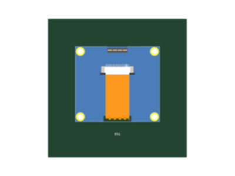

# Repro 32: bottom-mounted display shows its back in KiCad

## Problem and motivation

An HS154L03W2C01 display placed with `pcbRotation={180}` and `layer="bottom"`
shows its rear PCB and ribbon connector in KiCad when viewed from below. Its
screen should face outward from the bottom of the host board. The same display
and STEP asset placed on the top layer show the screen when viewed from above.

This repro makes the side-dependent model transform visible without other
components or routing. It is intended to support a correction to model rotation
conversion without compensating by changing the intended footprint placement.

## Reproduce

With dependencies installed and KiCad CLI 10 on PATH:

```sh
bun test tests/pcb/repros/repro32-display-bottom-model-rotation.test.tsx
```

The test generates two independent 70 × 70 mm, 1.4 mm thick boards through
`Circuit`, each with one DS1 at (0, 2), rotated 180°. Only `layer` changes.
KiCad renders the top board from the top and the bottom board from the bottom.

For manual inspection, the test writes both `.kicad_pcb` files, their generated
Circuit JSON, the decompressed STEP asset, and full-resolution renders into
ignored `debug-output/repro32/`. Keep `C7465999.step` next to the boards; the
model reference uses `${KIPRJMOD}/C7465999.step`.

## Observed and expected behavior

| Case | Input CAD rotation (X, Y, Z) | Exported local model rotation | View | Actual |
| --- | --- | --- | --- | --- |
| Top | 0, 0, 180 | 0, 0, 0 | Top | Screen visible |
| Bottom | 0, 180, 180 | 0, 180, 0 | Bottom | Rear PCB visible |

Both exports contain one footprint, eight pad/hole entries, and one model.
The model file is present and identical for both cases. The expected bottom
view is the screen facing outward, just as the top control faces outward.

`AddFootprintsStage` assigns the bottom footprint to `B.Cu`.
`create3DModelsFromCadComponent` copies the board-space CAD X/Y rotation and
subtracts only the footprint Z rotation. The bottom-side 180° Y rotation is
therefore retained inside a footprint that KiCad also places on the bottom.
This is consistent with applying the side flip twice. The general fix must
account for KiCad's footprint-local coordinate system and validate offsets
as well as rotations; this repro does not prescribe a complete transform fix.

**This is a characterization repro, not a fix.** Passing records the current
wrong bottom orientation. The snapshots and assertions should be updated when
the converter correctly maps bottom-side models.

## Snapshots

Top control, viewed from above (screen visible):


Bottom repro, viewed from below (rear PCB visible):



Both images are actual KiCad renders, not drawn expected results. Image
comparison flattens onto white, resizes to 400 × 300, and applies sigma-1 blur
to stabilize raytraced edges. Exact input rotations and exported model blocks
are captured in the text snapshot. The original full-resolution images remain
in `debug-output/repro32/`.

## Fixture provenance and reproducibility

- `assets/hs154l03w2c01.tsx`: formatting-normalized copy of
  [imports/c7465999.tsx in gokul/board-v2](https://api.tscircuit.com/package_files/get?package_release_id=d7f20f66-de06-4d63-bb3d-1ebeef18f23a&file_path=imports%2Fc7465999.tsx),
  retrieved 2026-09-03. Footprint, model URLs, and model origin are preserved.
- `assets/C7465999.step.gz`: losslessly compressed
  [original STEP model](https://modelcdn.tscircuit.com/easyeda_models/assets/C7465999.step?uuid=aa861fa4eb4a4bd2a39608f58e47f232).
  The decompressed SHA-256 is
  `5d32c3497644bfdf5a348d3f98cf159a9a7a54f7fc51bd9a5579c3682b93c77d`.
  The test verifies it before rendering. Compression reduces the approximately
  9.9 MB asset to 2 MB and allows offline runs.

Only the exported model path is substituted for local loading. Exported
rotations, offsets, scales, and footprint positions are left unchanged.
No missing-model workaround or hand-written Circuit JSON is involved.

## Validation

Verified with Bun 1.3.14, tscircuit 0.0.2046, and KiCad CLI 10.0.5.
Both model faces were visually inspected. Repository TypeScript checking passed.
